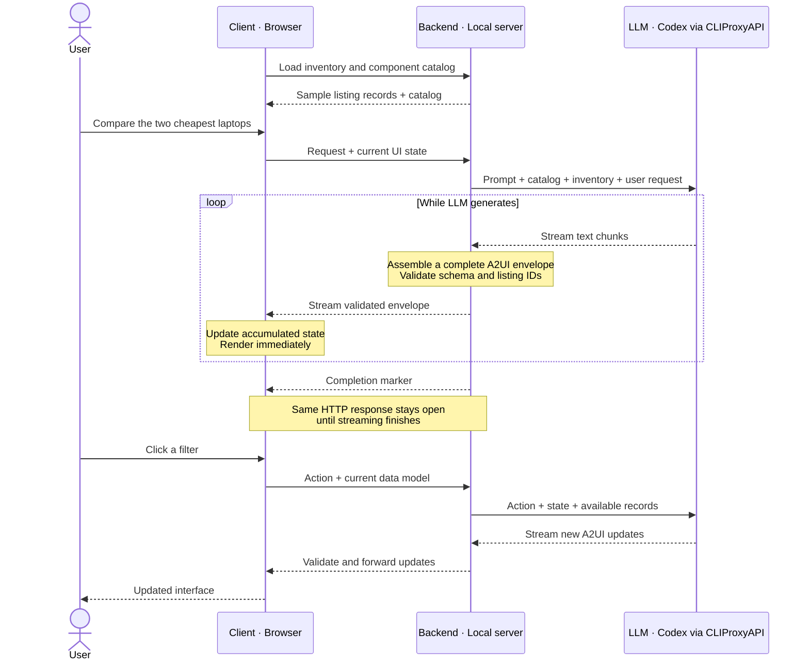

# Chợ Tốt A2UI demo

Local agent-driven listing demo using Google A2UI **v0.9** envelopes and Codex through CLIProxyAPI as the streaming inference provider. Sample inventory only; no production API, purchases, or seller messaging.

## Run

Requires Node 22+ and a running CLIProxyAPI with a Codex route. By default, the server reads the base URL, token, and model from `~/.ccs/codex.settings.json`; secrets never go to the browser.

```sh
npm install
npm run dev
```

Open http://localhost:3000. Override settings with `CCS_SETTINGS_PATH`, or supply `LLM_BASE_URL`, `LLM_API_KEY`, and `LLM_MODEL` through your environment. `npm test` runs protocol, filter, and stream parser checks.

`node test/browser.mjs` runs a live Codex search → filter → detail browser check using installed Google Chrome, checks mobile overflow, and writes screenshots to `test-results/`. It consumes inference usage.

`node test/streaming-live.mjs` verifies that the first listing card renders while inference is still streaming, then checks the completed results and records timing.

## Demo script

Use **Present ↗** in the navigation bar for fullscreen, larger type, and nine slides: four A2UI introductions followed by five A2UI / MCP Apps comparisons. Keyboard: `P` toggles presentation mode, arrow keys navigate slides, and `Esc` exits. Open `http://localhost:3000/?present=1` to start in presentation layout without requiring fullscreen. Normal mode retains all introduction content, the full comparison, and source links.

1. Ask “Tìm iPhone dưới 15 triệu ở TP.HCM”. Watch createSurface, updateDataModel, and updateComponents in the inspector.
2. Click Cá nhân or Có video. The renderer sends an A2UI action with the current data model in transport metadata; Codex returns an updated surface.
3. Open a listing, then return. Ask to compare two laptops. The agent switches the component tree to details or comparison.

## Architecture

The **Trace explained** tab walks through the recorded laptop-comparison response at 3.7s, 7.4s, 10.2s, and 13.3s. Each stage shows the exact envelope, accumulated state, and a schematic of visible UI. A separately labeled backend integration step explains where a listing-service call could occur, why records must reach the renderer, and how subsequent filter actions trigger another search. It does not execute a real backend request.

Browser → local HTTP endpoint → CLIProxyAPI `/v1/chat/completions` with `stream: true` → SSE text deltas → complete A2UI envelopes → validation → NDJSON → progressive catalog renderer.

The following diagram shows the current demo. The backend uses sample inventory; it does not call the Chợ Tốt listing API.



For a real integration, the backend fetches listing records before asking the LLM to describe the results, and makes those records available to the client.

Codex produces one protocol envelope per line. Each envelope is validated against the vendored official v0.9 server schema and the demo catalog before delivery. The server checks inventory IDs and search constraints before rendering listings. The frontend implements a bounded renderer, not the full basic catalog. Custom components: Column, Text, FilterBar, ListingCard, AdDetail, Comparison. The catalog ID is `urn:chotot:a2ui:demo:0.9`.

Rendering starts before inference completes: the agent emits the surface, data model, layout, and individual card updates in separate envelopes. The inspector shows envelope count, time to first envelope, and total duration. JSON is buffered only until a complete line is available, never rendered from partial JSON. Each turn sends the current data model. Errors are surfaced without mocked responses; if a stream fails after valid updates, the partial UI stays visible with an error. A completion marker prevents truncated streams from being reported as successful.

The demo makes inference-only HTTP requests and exposes no execution tools. Credentials remain server-side. The server binds to loopback, limits concurrent requests to two, and cancels upstream requests when clients disconnect. Requests have a 120-second timeout and output size limits.

## Source adaptation

Source reference: `/Users/hiraism/workspace/fe/ct-web-uni-adlisting`.

- `packages/helpers/filter/filterTagParams.js` is copied verbatim to `public/filterTagParams.js`: account types `p`/`c`, canonical serialization, video toggles, reset page to 1, and preservation of other filter values.
- `apps/ct-web-c2c-adlisting/src/components/ListAds/AdsCard/NormalAdsCard/index.tsx`: adapted card hierarchy, subject, price, thumbnail, seller type, location, and listing interaction.
- `.../AdsCard/LocationLabel.tsx` and `packages/components/OrderFilter/OrderFilter.js`: location presentation and private/video/price filters inform the local components.

The production React components themselves are not directly imported: they depend on Next.js routing, Redux, Linaria, private Chợ Tốt packages, and tracking infrastructure. The demo adapts their UI contract to standalone DOM components. Inventory fields retain Chợ Tốt naming (`list_id`, `subject`, `region_name`, `area_name`). Illustrations are placeholders.

Official schemas in `schemas/` originate from https://github.com/a2ui-project/a2ui/tree/main/specification/v0_9/json (Apache-2.0). Protocol docs: https://a2ui.org/. Codex headless docs: https://developers.openai.com/codex/noninteractive.
